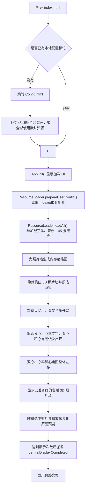

# 心动时刻

一个用原生 HTML、CSS 和 JavaScript 实现的沉浸式告白/求婚动画页面。页面可以直接双击 `index.html` 运行，也可以通过本地 HTTP 服务访问。首次打开动画页时会先进入 `Config.html`，用于配置照片和背景音乐。

在 `Config.html` 保存配置后，点击“心动时刻”会先加载字体、音乐和 45 张照片资源，并在加载阶段生成照片墙缩略图、提前隐藏构建 3D 照片墙。加载完成后依次播放背景音乐、歌词、飘落爱心、心动频率、双心跳动、心电图、右侧 3D 照片墙、像素化照片展示和最终文案。

## 当前特性

- 不依赖框架，使用原生 HTML/CSS/JavaScript。
- 支持直接双击 `index.html` 运行。
- 新增 `Config.html` 配置页，可上传 45 张照片和自定义背景音乐。
- 上传的文件会保存到浏览器 IndexedDB；网页不能直接写回项目的 `imgs/` 或 `music/` 文件夹。
- `index.html` 加载 `js/bundle.js`，避免 `file://` 环境下 ES Module 导入限制。
- 启动阶段预加载字体、音乐和 45 张照片。
- 加载图片时会生成内存缩略图，右侧 3D 照片墙使用缩略图显示，点击放大和像素化预览仍使用原图。
- 3D 照片墙会提前隐藏构建并做渲染预热，到剧情节点时直接显示，减少出现时的卡顿。
- 所有源码 JS 已按模块、类、方法和关键流程补充注释。
- 配置集中在 `js/config/config.js`，便于调整资源路径、动画参数、照片墙布局和最终文案。

## 目录结构

```text
.
|-- index.html                         # 页面入口，包含启动按钮和加载进度 UI
|-- Config.html                        # 本地配置页，上传照片和背景音乐
|-- css/
|   |-- style.css                      # 全局样式、按钮、加载条和基础动画
|   `-- config.css                     # 配置页样式
|-- font/
|   `-- keai.ttf                       # 自定义字体
|-- imgs/
|   |-- 1.jpg ... 45.jpg               # 照片墙原图资源
|   `-- icon.png                       # 页面图标
|-- js/
|   |-- bundle.js                      # 生成后的运行脚本，不建议手动编辑
|   |-- configPage.js                  # 配置页逻辑，保存上传资源到 IndexedDB
|   |-- app.js                         # 应用入口和动画流程编排
|   |-- resourceLoader.js              # 字体、图片、音乐预加载和缩略图生成
|   |-- config/
|   |   `-- config.js                  # 资源、动画、照片墙、最终文案配置
|   |-- effects/
|   |   |-- BackgroundMusicEffect.js    # 背景音乐和歌词同步
|   |   |-- FallingHeartsEffect.js      # 背景飘落爱心
|   |   |-- Heart.js                    # 单颗小爱心粒子
|   |   |-- HeartEffect.js              # 主爱心动画
|   |   |-- SecondHeartEffect.js        # 第二颗爱心动画
|   |   |-- HeartRateEffect.js          # 心动频率文字
|   |   |-- ECGEffect.js                # 心电图波形
|   |   |-- NewPhotoWall.js             # 右侧 3D 照片墙和随机选择
|   |   |-- NewPixelatedPreview.js      # 选中照片的像素化展示
|   |   `-- ProposalMessageEffect.js    # 最终文案打字动画
|   `-- utils/
|       |-- heartPath.js               # 共享爱心 Path2D 缓存
|       `-- userConfigStore.js         # 动画页读取 Config.html 保存的本地配置
|-- music/
|   `-- everyTimeWeTouch.mp3           # 背景音乐
`-- scripts/
    `-- build-bundle.js                # 将模块源码合并为 js/bundle.js
```

## 运行方式

### 直接双击

直接双击项目根目录下的 `index.html` 即可运行。

首次打开时，如果还没有保存配置，`index.html` 会自动跳转到 `Config.html`。

在配置页中可以：

- 必须上传 45 张照片后才能保存配置。
- 照片可以一次性多选，也可以分多次选择；后续选择会追加，不会覆盖已选照片。
- 一次性选择多张照片时，配置页会逐张处理并实时刷新照片进度条。
- 每张照片都可以单独删除，删除后可以继续选择新的照片补齐。
- 上传自定义背景音乐，或继续使用默认音乐。
- 音频一次只保留一个文件，重新选择会替换当前音频。
- 配置右侧 3D 照片墙标题。
- 配置最终文案。
- 配置右侧照片墙随机展示几张照片后再显示最终文案，默认 10 次。
- 背景音乐、照片墙标题、最终文案和歌词都是可选项；不填写时使用项目默认配置。
- 开启“自定义歌词”后，可以手动填写歌词或上传 LRC 文件，二选一。
- 保存配置后打开动画页。
- 选择“全部使用默认资源”，直接使用项目自带照片和音乐。

这是当前推荐方式。项目已经通过 `js/bundle.js` 兼容普通 `file://` 打开方式，上传配置则通过浏览器 IndexedDB 保存在本地。

### 本地 HTTP 服务

也可以通过本地服务访问，例如：

```bash
python -m http.server 8000
```

然后访问：

```text
http://localhost:8000
```

两种方式都可以运行。区别是：当前页面实际加载的是普通脚本 `js/bundle.js`，所以它既支持双击，也支持 HTTP 服务。

## 开发说明

源码采用 ES Module 写法，例如：

```js
import { resourceLoader } from './resourceLoader.js';
export const heart = new HeartEffect();
```

但 `index.html` 运行时加载的是生成后的普通脚本：

```html
<script src="./js/bundle.js"></script>
```

这是为了兼容直接双击 `index.html` 的运行方式。`js/bundle.js` 由 `scripts/build-bundle.js` 自动合并生成，不建议手动修改。

修改以下源码后，都需要重新生成 `bundle.js`：

- `js/app.js`
- `js/resourceLoader.js`
- `js/config/config.js`
- `js/effects/*.js`
- `js/utils/*.js`

`Config.html`、`css/config.css` 和 `js/configPage.js` 是配置页本身，不参与 `bundle.js` 打包。

执行：

```bash
node scripts/build-bundle.js
```

语法检查：

```bash
node --check js/bundle.js
```

PowerShell 下检查所有源码 JS：

```powershell
Get-ChildItem -Recurse -Filter *.js |
  Where-Object { $_.FullName -notlike '*\bundle.js' } |
  ForEach-Object { node --check $_.FullName }
```

## 核心流程



## 主要模块

| 文件 | 作用 |
| --- | --- |
| `Config.html` | 本地配置页，上传 45 张照片和背景音乐。 |
| `js/configPage.js` | 配置页逻辑，把上传文件保存到 IndexedDB，并写入本地配置标记。 |
| `js/app.js` | 应用入口，负责加载流程、照片墙预热和动画时间线编排。 |
| `js/resourceLoader.js` | 预加载字体、音乐和图片；为照片墙生成内存缩略图；通过 `onProgress` 更新进度。 |
| `js/utils/userConfigStore.js` | 动画页读取 `Config.html` 保存的用户资源配置。 |
| `js/config/config.js` | 全局配置中心，包含资源路径、动画参数、照片墙样式和最终文案。 |
| `js/effects/BackgroundMusicEffect.js` | 播放背景音乐，淡入音量，并按时间同步歌词。 |
| `js/effects/FallingHeartsEffect.js` | 用 Canvas 绘制背景飘落小爱心。 |
| `js/effects/Heart.js` | 单颗飘落爱心粒子的模型和绘制逻辑。 |
| `js/effects/HeartEffect.js` | 绘制主爱心，包括跳动、余波、旋转、阴影和偏移。 |
| `js/effects/SecondHeartEffect.js` | 绘制第二颗爱心，配合主爱心形成双心构图。 |
| `js/effects/HeartRateEffect.js` | 绘制“心动频率”文字，主爱心出现后读取主爱心心率。 |
| `js/effects/ECGEffect.js` | 根据主爱心跳动状态绘制动态心电图。 |
| `js/effects/NewPhotoWall.js` | 创建右侧 3D 心形照片墙，处理 hover、点击预览、随机选择和流程事件。 |
| `js/effects/NewPixelatedPreview.js` | 将选中照片拆成像素块，播放聚合和散开动画。 |
| `js/effects/ProposalMessageEffect.js` | 监听照片墙完成事件，显示最终打字文案。 |
| `js/utils/heartPath.js` | 缓存共享爱心 `Path2D`，减少每帧重复计算。 |

## 本地配置存储

`Config.html` 不会也不能把上传文件直接写回项目目录。浏览器普通网页没有权限修改本地文件夹中的 `imgs/` 或 `music/`。

当前实现使用 IndexedDB 保存上传文件：

- 45 张照片保存为 Blob 列表。
- 背景音乐保存为 Blob。
- 照片墙标题保存为普通文本。
- 最终文案保存为原始多行文本和按行拆分后的数组。
- 最终文案触发次数保存为数字，控制右侧照片墙随机展示多少次后进入最终打字文案。
- 是否使用自定义歌词保存为布尔值；没有填写歌词时会继续使用项目内置歌词。
- 开启自定义歌词并填写内容时，手动填写或上传的 LRC 文本会保存为原始输入文本和解析后的时间轴数组。
- 配置页会显示照片上传进度和音频上传进度。
- 配置页左侧照片预览会生成 360px 方形缩略图，保证预览放大后仍然清晰。
- `localStorage.proposalConfigReady` 用来标记是否已经完成配置。
- 动画页启动时，`resourceLoader.prepareUserConfig()` 会读取 IndexedDB。
- 如果配置存在，图片和音乐 Blob 会被转换为 object URL，后续加载流程照常运行。
- 如果选择“全部使用默认资源”，动画页会继续使用项目自带的 `imgs/` 和 `music/` 文件，并显示内置默认歌词。

清除配置后，再打开 `index.html` 会重新回到 `Config.html`。

## 资源加载和进度条

当前进度条是“资源完成数量进度”，不是“字节级进度”。

也就是说：

- 字体加载完成，进度加一次。
- 音乐达到可播放状态，进度加一次。
- 每张图片加载、解码并生成缩略图后，进度加一次。

500KB 图片和 13MB 图片都只算一个资源，所以进度条是真实的完成数量统计，但不是按 MB 精确计算的下载进度。

加载条下方会显示：

- `资源加载中`
- `资源加载完成`
- `资源加载失败`

## 照片墙性能策略

当前照片墙的性能优化逻辑如下：

1. `RESOURCE_CONFIG.IMAGES.preload` 默认为 `true`。
2. 启动阶段加载 `imgs/1.jpg` 到 `imgs/45.jpg`。
3. 每张图片加载后生成 180px 内存缩略图。
4. 右侧 3D 照片墙小图使用缩略图。
5. 点击放大和像素化预览继续使用原图。
6. 照片墙提前创建，但以 `opacity: 0` 隐藏，避免 `display: none` 导致浏览器跳过布局和渲染。
7. 加载页阶段调用 `warmUpRender()`，给浏览器提前布局、绘制和合成的机会。

这套方式把照片墙出现时的压力提前到加载阶段，因此右侧 3D 照片墙出现会更流畅。

## 自定义内容

### 修改最终文案

推荐方式是在 `Config.html` 的“展示内容配置”区域填写“最终文案”并保存配置，不需要重新生成 `bundle.js`。每一行会作为最终文案的一行显示；留空时使用项目默认文案。

如果想修改项目默认文案，可以在 `js/config/config.js` 中修改：

```js
export const PROPOSAL_MESSAGE_CONFIG = {
    LINES: [
        'XXX女士',
        '你愿意嫁给',
        'XXX先生吗？'
    ]
};
```

修改后执行：

```bash
node scripts/build-bundle.js
```

### 修改最终文案出现时机

推荐方式是在 `Config.html` 的“显示几张照片后显示最终文案”中填写次数并保存配置。默认是 10 次，数值越大，右侧照片墙随机放大和像素化预览会播放得越久。

如果想修改项目默认次数，可以在 `js/config/config.js` 中修改：

```js
export const PHOTO_WALL_CONFIG = {
    MAX_CENTER_DISPLAY: 10
};
```

修改后执行：

```bash
node scripts/build-bundle.js
```

### 修改照片墙标题

推荐方式是在 `Config.html` 的“展示内容配置”区域填写“右侧照片墙标题”并保存配置，不需要重新生成 `bundle.js`。
如果不填写，默认标题为“可可爱爱的我们”。

如果想修改项目默认标题，可以在 `js/config/config.js` 中修改：

```js
export const PHOTO_WALL_CONFIG = {
    TITLE: {
        TEXT: '新的标题'
    }
};
```

### 替换照片

推荐方式是在 `Config.html` 中上传 45 张照片并保存配置。这样不需要改动项目文件，也不需要重新生成 `bundle.js`。

默认照片路径为：

```text
imgs/1.jpg
imgs/2.jpg
...
imgs/45.jpg
```

最简单的替换方式是保持文件名不变，直接替换这 45 张图片。

如果要修改数量，需要同时检查：

- `RESOURCE_CONFIG.IMAGES.totalCount`
- `NewPhotoWall.js` 中的 `heartTemplate`
- `PHOTO_WALL_CONFIG.MAX_CENTER_DISPLAY`

### 替换背景音乐和歌词

- 推荐方式：在 `Config.html` 的“展示内容配置”区域开启“自定义歌词”，然后手动填写歌词或上传 LRC 文件后保存配置。
- 如果不填写歌词，动画页会使用项目内置默认歌词。
- 音乐文件：替换 `music/everyTimeWeTouch.mp3`，或修改 `RESOURCE_CONFIG.AUDIO`。
- 歌词时间轴格式：每一行一条歌词，写成 `[分钟:秒] 歌词原文 | 翻译`。
- 翻译可以省略，秒数支持小数。
- 兼容常见 LRC 时间戳，例如 `[00:00.000] 作曲 : 曾轶可`。
- `[ar:歌手]`、`[ti:歌名]`、`[offset:0]` 这类 LRC 元信息行会自动忽略。
- 手动填写和上传 LRC 文件是二选一关系，保存时只使用当前选中的歌词来源。
- 只有开启“自定义歌词”且填写有效歌词时，动画页才会使用自定义歌词。

示例：

```text
[00:11] I still hear your voice when you sleep next to me | 当你睡在我身边，我仍能听见你的声音
[00:20] I still feel your touch in my dreams | 我仍能在梦里感觉到你的触碰
[01:20.5] Cause everytime we touch
```

如果没有填写自定义歌词，动画页会显示项目内置歌词。

修改后执行：

```bash
node scripts/build-bundle.js
```

## 注释维护说明

当前所有源码 JS 都已经添加说明性注释。建议后续维护时遵循这个原则：

- 新增模块时，在文件顶部说明模块职责。
- 新增类时，说明它负责哪一段动画或流程。
- 新增方法时，说明触发时机、输入输出和副作用。
- 对性能相关逻辑保留原因说明，例如图片缩略图、隐藏预渲染、RAF 启停等。
- 不直接修改 `js/bundle.js`，应修改源码后重新生成。

## 浏览器兼容

项目依赖以下浏览器能力：

- Canvas 2D
- Path2D
- FontFace API
- HTMLAudioElement
- CustomEvent
- ES Module 源码构建能力

建议使用较新的 Chrome、Edge、Firefox 或 Safari。

## 部署说明

这是纯静态项目，可以部署到任意静态文件服务器，例如 Nginx、GitHub Pages、Netlify、Vercel 或对象存储静态站点。

部署时保持目录结构不变：

```text
/index.html
/Config.html
/css/style.css
/css/config.css
/js/bundle.js
/js/configPage.js
/imgs/1.jpg
/font/keai.ttf
/music/everyTimeWeTouch.mp3
```

## 注意事项

- 当前图片资源体积较大，首次加载会有等待时间，这是为了换取后续动画和照片墙显示更流畅。
- 自定义上传资源会占用浏览器本地存储空间；清除浏览器站点数据后，需要重新配置。
- 右侧照片墙更适合桌面端或大屏展示。
- 浏览器音频自动播放策略通常要求用户先产生交互，本项目通过点击“心动时刻”启动音乐，符合常见浏览器策略。
- `bundle.js` 代码量大是正常的，因为它合并了所有源码模块和注释。
